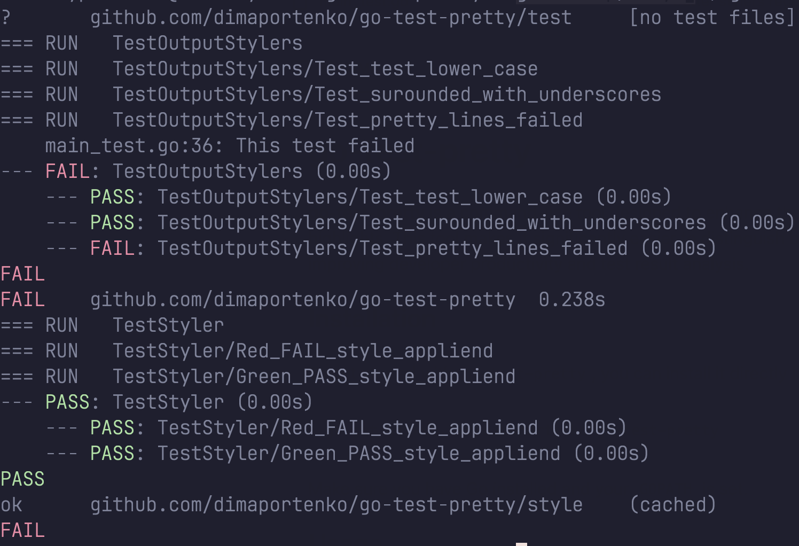

# go-test-pretty 

**go-test-pretty** is a command-line tool designed to enhance the readability of `go test` output by adding color highlights. This tool makes it significantly easier to distinguish between `PASS` and `FAIL` test results at a glance, improving developer productivity and test result analysis.



Installation
------------
To get started with `go-test-pretty`, you can install it directly into your Go workspace by running:
```sh
go get github.com/dimaportenko/go-test-pretty 
```

Make sure you have Go installed and your `GOPATH` is set.

Usage
-----

Once installed, you can simply pipe the output of `go test` through `go-test-pretty` to see the enhanced output:
```sh
go test ./... | go-test-pretty
```
